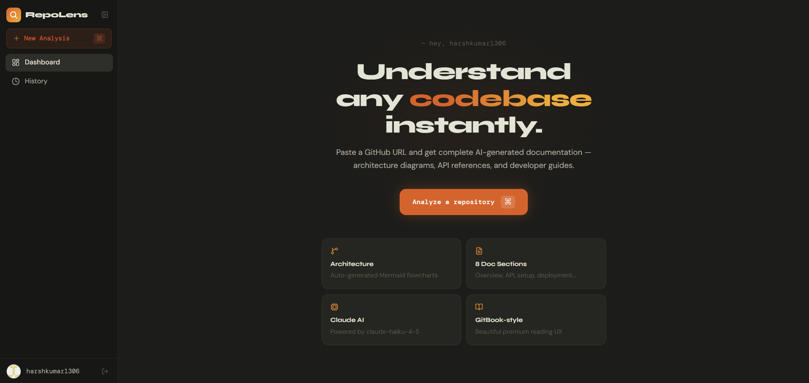
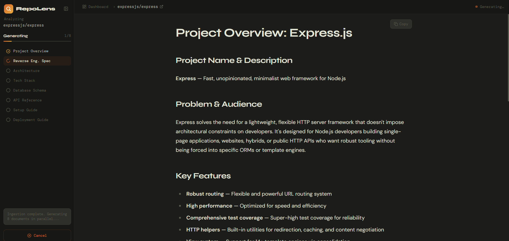
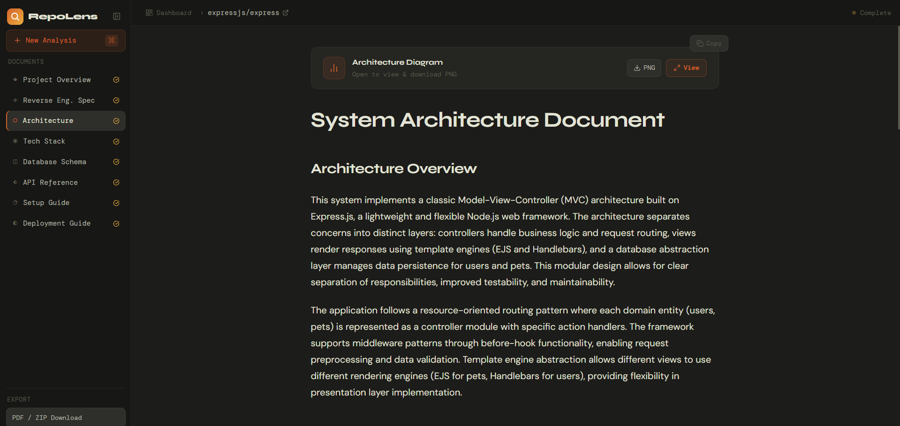

# RepoLens — AI-Powered Repository Documentation

<div align="center">


**Paste a GitHub URL. Get complete AI-generated documentation in seconds.**

[](https://repolens-kappa.vercel.app)
[](https://repolens-backend-awkk.onrender.com)
[](#license)
[](https://nodejs.org)
[](https://react.dev)

</div>

---

## What is RepoLens?

RepoLens is a full-stack AI documentation tool built as a Computer Science project. You paste any public GitHub repository URL and RepoLens:

1. **Intelligently ingests** the repository using a 4-layer pipeline that handles repos of any size
2. **Generates 8 structured documentation pages** in parallel using the Claude AI API
3. **Displays results** in a beautiful premium dark-themed tabbed viewer with live Mermaid diagrams
4. **Exports** everything as a PDF or Markdown ZIP bundle

The entire experience is real-time — you watch each document appear as it's generated via WebSocket updates, no page refreshing needed.

---

## Screenshots

---

## Screenshots

> Dashboard → Analyze a Repo → Live Generation → Results Viewer

### Dashboard
Clean minimal landing



---

### Generation Progress
Live checklist via WebSockets



---

### Results Viewer
Tabbed doc viewer with Mermaid



---

---

## Features

### Core
- **GitHub OAuth login** — no passwords, one-click sign in
- **Any public repo** — paste any `https://github.com/owner/repo` URL
- **8 AI-generated documents** — full documentation suite per repo (see below)
- **Real-time progress** — WebSocket-powered live checklist as each doc generates
- **Smart repo caching** — previously analyzed repos load instantly from cache (24h TTL)
- **Repo size guard** — repos over 50MB or 2,000 files are rejected before wasting API calls

### Generated Documents
| # | Document | Description |
|---|---|---|
| 1 | **Project Overview** | What it does, who it's for, key features |
| 2 | **Reverse Engineer Spec** | User stories, requirements, AI rebuild prompt |
| 3 | **System Architecture** | Component diagram as a live Mermaid flowchart |
| 4 | **Tech Stack Breakdown** | Every dependency, its role, why it was chosen |
| 5 | **Database Schema** | ER diagram as a live Mermaid diagram + table explanations |
| 6 | **API Reference** | All endpoints, methods, params, auth requirements |
| 7 | **Developer Setup Guide** | Step-by-step onboarding for new developers |
| 8 | **Deployment Guide** | Platform-specific deployment instructions |

### Reliability
- **Retry logic** — each Claude API call retried up to 3 times with exponential backoff
- **Partial failure handling** — if ≤4 docs fail, the rest still complete and display
- **GitHub rate limit guard** — pauses ingestion automatically if API calls drop below 50 remaining
- **Job recovery** — failed jobs show exactly which documents couldn't generate

### Export & UX
- **PDF export** — Puppeteer-rendered multi-page PDF with cover page and table of contents
- **ZIP export** — all 8 docs as numbered `.md` files with a README index
- **Copy button** — one-click copy on every document
- **Mermaid diagrams** — rendered as live SVG, expandable in a modal, downloadable as PNG
- **Analysis history** — every repo you've analyzed, searchable, with clear-all option
- **Command palette** — `⌘K` to open the repo input from anywhere
- **Collapsible sidebar** — icon-only rail mode with tooltips
- **Mobile responsive** — slide-out drawer navigation on mobile

---

## Tech Stack

### Frontend
| Technology | Role |
|---|---|
| React 18 + Vite | UI framework and build tool |
| TailwindCSS | Utility-first styling |
| Framer Motion | Page transitions and animations |
| React Router v6 | Client-side routing |
| Socket.io Client | Real-time WebSocket updates |
| Mermaid.js | Architecture and ER diagram rendering |
| react-markdown + remark-gfm | Markdown rendering with GitHub flavour |
| Axios | HTTP client with credential support |

### Backend
| Technology | Role |
|---|---|
| Node.js + Express | API server |
| Socket.io | WebSocket server for real-time progress |
| Prisma ORM | Type-safe database client |
| PostgreSQL (Neon.tech) | Persistent storage |
| @octokit/rest | GitHub API integration |
| Anthropic SDK | Claude AI document generation |
| p-queue | Parallel AI calls with concurrency limiting |
| Puppeteer | Headless Chrome for PDF generation |
| archiver | ZIP bundle creation |
| connect-pg-simple | PostgreSQL-backed session store |

### Infrastructure
| Service | Purpose |
|---|---|
| Vercel | Frontend hosting with API proxy rewrites |
| Render.com | Backend Node.js hosting |
| Neon.tech | Serverless PostgreSQL |
| GitHub OAuth | Authentication |
| Anthropic Claude | `claude-haiku-4-5` model for generation |

---

## Architecture Overview

```
┌─────────────────────────────────────────────────────────────┐
│                        User Browser                         │
│  React + Vite (Vercel)                                      │
│  ┌──────────┐  ┌───────────────┐  ┌──────────────────────┐  │
│  │ Sidebar  │  │ Command       │  │ Results Viewer       │  │
│  │ Nav      │  │ Palette (⌘K) │  │ DocViewer + Mermaid  │  │
│  └──────────┘  └───────────────┘  └──────────────────────┘  │
└───────────────────────┬─────────────────────────────────────┘
                        │ REST (via Vercel proxy)
                        │ WebSocket (direct to Render)
┌───────────────────────▼─────────────────────────────────────┐
│                    Express Backend (Render)                 │
│  ┌──────────┐  ┌──────────────┐  ┌───────────────────────┐  │
│  │ Auth     │  │ Jobs API     │  │ Export API            │  │
│  │ /auth/*  │  │ /api/jobs/*  │  │ /api/export/*         │  │
│  └──────────┘  └──────┬───────┘  └───────────────────────┘  │
│                       │                                     │
│  ┌────────────────────▼─────────────────────────────────┐   │
│  │              4-Layer Ingestion Pipeline              │   │
│  │  Layer 1: Size check (50MB / 2000 files limit)       │   │
│  │  Layer 2: File tree fetch + noise filter             │   │
│  │  Layer 3: Tier ranking (Tier 1 / 2 / 3)              │   │
│  │  Layer 4: Content fetch + rate limit guard           │   │
│  └─────────────────────┬────────────────────────────────┘   │
│                        │                                    │
│  ┌─────────────────────▼────────────────────────────────┐   │
│  │          Generation Engine (p-queue, concurrency 3)  │   │
│  │  8 Claude API calls → retry × 3 → save → emit        │   │
│  └──────────────────────────────────────────────────────┘   │
└───────────────────────┬──────────────────┬──────────────────┘
                        │                  │
           ┌────────────▼────┐    ┌────────▼──────────┐
           │  PostgreSQL     │    │  GitHub API       │
           │  (Neon.tech)    │    │  (Octokit)        │
           └─────────────────┘    └───────────────────┘
                                           │
                                  ┌────────▼──────────┐
                                  │ Anthropic Claude  │
                                  │ (claude-haiku-4-5)│
                                  └───────────────────┘
```

---

## Database Schema

```prisma
model User {
  id          String   @id @default(cuid())
  githubId    String   @unique
  username    String
  avatarUrl   String
  accessToken String
  createdAt   DateTime @default(now())
  jobs        Job[]
}

model Job {
  id        String      @id @default(cuid())
  repoUrl   String
  repoName  String
  status    JobStatus   @default(PENDING)
  error     String?
  createdAt DateTime    @default(now())
  userId    String
  user      User        @relation(fields: [userId], references: [id])
  documents Document[]
}

model Document {
  id        String       @id @default(cuid())
  type      DocumentType
  content   String
  jobId     String
  job       Job          @relation(fields: [jobId], references: [id])
  createdAt DateTime     @default(now())
}

model RepoCache {
  id            String           @id @default(cuid())
  repoHash      String           @unique
  repoUrl       String
  lastGenerated DateTime         @default(now())
  documents     CachedDocument[]
}

model CachedDocument {
  id          String       @id @default(cuid())
  type        DocumentType
  content     String
  repoCacheId String
  repoCache   RepoCache    @relation(fields: [repoCacheId], references: [id])
}

enum JobStatus   { PENDING PROCESSING DONE FAILED }
enum DocumentType { OVERVIEW SPEC ARCHITECTURE TECHSTACK DATABASE API SETUP DEPLOYMENT }
```

---

## API Reference

### Authentication
| Method | Route | Description |
|---|---|---|
| `GET` | `/auth/github` | Redirect to GitHub OAuth |
| `GET` | `/auth/github/callback` | OAuth callback, create session |
| `GET` | `/auth/me` | Return current user from session |
| `GET` | `/auth/logout` | Destroy session |

### Jobs
| Method | Route | Description |
|---|---|---|
| `POST` | `/api/jobs` | Submit repo URL, returns `jobId` |
| `GET` | `/api/jobs` | All jobs for current user (history) |
| `GET` | `/api/jobs/:id` | Single job with all documents |
| `DELETE` | `/api/jobs` | Clear all jobs for current user |

### Export
| Method | Route | Description |
|---|---|---|
| `GET` | `/api/export/:jobId/pdf` | Generate and download PDF |
| `GET` | `/api/export/:jobId/zip` | Generate and download Markdown ZIP |

### WebSocket Events
```
Client → Server:  join { jobId }          — join job room for updates

Server → Client:  job:status      { status, message }
                  job:rateLimit   { message, resumeIn }
                  job:docComplete { type, content }
                  job:done        { jobId }
                  job:cached      { message, jobId }
                  job:error       { message }
```

---

## Project Structure

```
repolens/
├── frontend/
│   ├── src/
│   │   ├── components/
│   │   │   ├── Sidebar.jsx          # Collapsible nav with icon rail
│   │   │   ├── CommandPalette.jsx   # ⌘K repo input modal
│   │   │   ├── DocViewer.jsx        # Tabbed documentation viewer
│   │   │   ├── DocTab.jsx           # Single doc with copy button
│   │   │   ├── MermaidDiagram.jsx   # SVG diagram renderer + PNG export
│   │   │   ├── PdfModal.jsx         # Export modal (PDF + ZIP)
│   │   │   └── HistoryCard.jsx      # History list item
│   │   ├── pages/
│   │   │   ├── Dashboard.jsx        # Landing page with CTA
│   │   │   ├── Results.jsx          # Live generation + doc viewer
│   │   │   ├── History.jsx          # Past analyses with search
│   │   │   └── Login.jsx            # GitHub OAuth entry point
│   │   ├── hooks/
│   │   │   ├── useAuth.js           # Session + user state
│   │   │   └── useSocket.js         # WebSocket connection hook
│   │   ├── lib/
│   │   │   └── api.js               # Axios instance with credentials
│   │   └── App.jsx                  # Router + AppContext provider
│   ├── vercel.json                  # Proxy rewrites to Render backend
│   └── package.json
│
├── backend/
│   ├── prisma/
│   │   └── schema.prisma
│   ├── src/
│   │   ├── routes/
│   │   │   ├── auth.js              # GitHub OAuth routes
│   │   │   ├── jobs.js              # Job CRUD + cache check
│   │   │   ├── documents.js         # Document fetch routes
│   │   │   └── export.js            # PDF + ZIP route handlers
│   │   ├── services/
│   │   │   ├── ingestion.js         # 4-layer repo ingestion pipeline
│   │   │   ├── generation.js        # Claude generation + p-queue
│   │   │   ├── prompts.js           # 8 Claude system prompts
│   │   │   ├── cache.js             # RepoCache read/write
│   │   │   ├── export.js            # Puppeteer PDF + archiver ZIP
│   │   │   └── rateLimit.js         # GitHub rate limit guard
│   │   ├── lib/
│   │   │   ├── anthropic.js         # Claude client + retry wrapper
│   │   │   ├── octokit.js           # GitHub API client factory
│   │   │   ├── socket.js            # Socket.io instance + emitter
│   │   │   ├── constants.js         # Shared limits and config
│   │   │   └── sleep.js             # Async sleep utility
│   │   ├── middleware/
│   │   │   └── auth.js              # requireAuth middleware
│   │   └── index.js                 # Express app + HTTP server entry
│   └── package.json
│
└── README.md
```

---

## Local Development Setup

### Prerequisites
- Node.js 18+
- A [Neon.tech](https://neon.tech) PostgreSQL database (free tier)
- A [GitHub OAuth App](https://github.com/settings/developers)
- An [Anthropic API key](https://console.anthropic.com)

### Step 1 — Clone the repo
```bash
git clone https://github.com/harshkumar1306/repolens.git
cd repolens
```

### Step 2 — Backend setup
```bash
cd backend
npm install
```

Create `backend/.env`:
```env
DATABASE_URL=postgresql://...          # From Neon.tech dashboard
GITHUB_CLIENT_ID=...                   # From GitHub OAuth App settings
GITHUB_CLIENT_SECRET=...               # From GitHub OAuth App settings
ANTHROPIC_API_KEY=sk-ant-...           # From console.anthropic.com
SESSION_SECRET=any_long_random_string
FRONTEND_URL=http://localhost:5173
BACKEND_URL=http://localhost:3001
PORT=3001
NODE_ENV=development
```

Run Prisma migrations:
```bash
npx prisma generate
npx prisma db push
```

Start the backend:
```bash
node src/index.js
```

Backend runs on `http://localhost:3001`

### Step 3 — Frontend setup
```bash
cd ../frontend
npm install
```

Create `frontend/.env`:
```env
VITE_API_URL=http://localhost:3001
VITE_SOCKET_URL=http://localhost:3001
VITE_GITHUB_CLIENT_ID=...              # Same as backend GITHUB_CLIENT_ID
```

Start the frontend:
```bash
npm run dev
```

Frontend runs on `http://localhost:5173`

### Step 4 — GitHub OAuth App settings
In your GitHub OAuth App, set:
- **Homepage URL:** `http://localhost:5173`
- **Authorization callback URL:** `http://localhost:3001/auth/github/callback`

---

## Deployment

### Backend — Render.com

1. Create a new **Web Service** on Render, connect your GitHub repo
2. Set **Root Directory** to `backend`
3. Set **Build Command** to:
   ```
   npm install && npx prisma generate && npx puppeteer browsers install chrome
   ```
4. Set **Start Command** to:
   ```
   node src/index.js
   ```
5. Add all environment variables from `.env` in the Render dashboard
6. Change `NODE_ENV` to `production`

### Frontend — Vercel

1. Import your GitHub repo on Vercel
2. Set **Root Directory** to `frontend`
3. Add environment variables:
   ```
   VITE_API_URL=https://your-vercel-domain.vercel.app
   VITE_SOCKET_URL=https://your-render-url.onrender.com
   VITE_GITHUB_CLIENT_ID=your_github_client_id
   ```
4. The `vercel.json` proxy config is already included — it routes `/api/*` and `/auth/*` through Vercel to Render so cookies work cross-origin

### Important after deploy
- Update `FRONTEND_URL` and `BACKEND_URL` on Render to your production URLs
- Update your GitHub OAuth App callback URL to `https://your-render-url.onrender.com/auth/github/callback`

---

## Environment Variables Reference

### Backend
| Variable | Description |
|---|---|
| `DATABASE_URL` | PostgreSQL connection string from Neon.tech |
| `GITHUB_CLIENT_ID` | GitHub OAuth App client ID |
| `GITHUB_CLIENT_SECRET` | GitHub OAuth App client secret |
| `ANTHROPIC_API_KEY` | Anthropic Claude API key |
| `SESSION_SECRET` | Any long random string for session encryption |
| `FRONTEND_URL` | Full URL of the frontend (Vercel) |
| `BACKEND_URL` | Full URL of the backend (Render) |
| `PORT` | Server port (Render sets this automatically) |
| `NODE_ENV` | `development` or `production` |

### Frontend
| Variable | Description |
|---|---|
| `VITE_API_URL` | Frontend's own URL (API calls go through Vercel proxy) |
| `VITE_SOCKET_URL` | Direct Render URL (WebSockets can't go through Vercel proxy) |
| `VITE_GITHUB_CLIENT_ID` | GitHub OAuth App client ID |

---

## Limits & Constraints

| Limit | Value | Reason |
|---|---|---|
| Max repo size | 50 MB | Prevents excessive GitHub API usage |
| Max repo files | 2,000 files | Prevents excessive ingestion time |
| Max Tier 1 files fetched | 30 files | Key config/entry files only |
| Max Tier 2 files fetched | 50 files | Route/controller/model files |
| Claude API concurrency | 3 parallel calls | Anthropic rate limit safety |
| Claude retry attempts | 3 (2s, 4s, 6s backoff) | Handles transient API errors |
| Max doc failures before job fails | 4 out of 8 | Partial results still shown |
| Cache TTL | 24 hours | Balance freshness vs. API cost |
| GitHub rate limit threshold | 50 remaining calls | Pause before hitting zero |

---

## How the Ingestion Pipeline Works

```
Layer 1 — Size Check
  └─ octokit.repos.get() → reject if > 50MB

Layer 2 — File Tree + Noise Filter
  └─ Fetch recursive tree → filter out node_modules, .git,
     dist, build, images, fonts, minified files, lock files

Layer 3 — Tier Ranking
  ├─ Tier 1 (max 30): README, package.json, Dockerfile,
  │                   schema files, entry points (index/main/app/server)
  ├─ Tier 2 (max 50): routes/, controllers/, models/,
  │                   api/, config/, middleware/
  └─ Tier 3: file paths only (no content fetched)

Layer 4 — Content Fetch + Rate Guard
  └─ Fetch Tier 1 + Tier 2 file contents
     Check rate limit every 20 files → pause if < 50 remaining
     Emit job:rateLimit via WebSocket if pausing
```

Each Claude prompt only receives the files relevant to that document type — architecture gets entry points and Docker files, API reference gets route files, etc.

---

## License

MIT — free to use, modify, and distribute with attribution.

---

## Author

**Srajal Singh** — Computer Science Student

[](https://github.com/srajalthakur)

---

<div align="center">
  <p>Built with Claude AI · Deployed on Vercel + Render · Database on Neon.tech</p>
  <p>
    <a href="https://repolens-kappa.vercel.app">Live Demo</a>
    &nbsp;·&nbsp;
    <a href="https://github.com/harshkumar1306/repolens/issues">Report Bug</a>
  </p>
</div>
